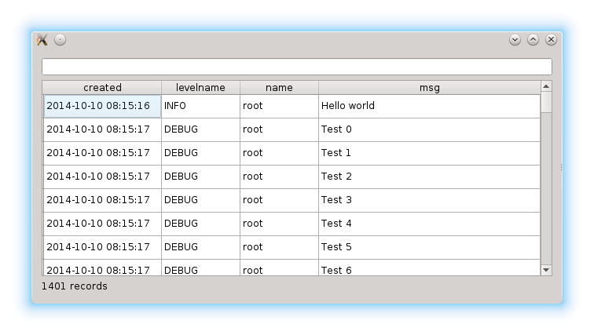

About
=====

This is a small utility that receives log messages sent over udp via the udp
handler which is built into the python standard library.

The utility listens to udp port 9021. To test the utility, run the example_client.py
file. To run the logger, run the udplogreceiver script.

Installation
------------

You can install the logviewer via pip:

.. code:: bash

  $ pip install udplogviewer

Dependencies
------------

- python3
- PyQt4 or PyQt5 Qt bindings

Screenshot
----------

